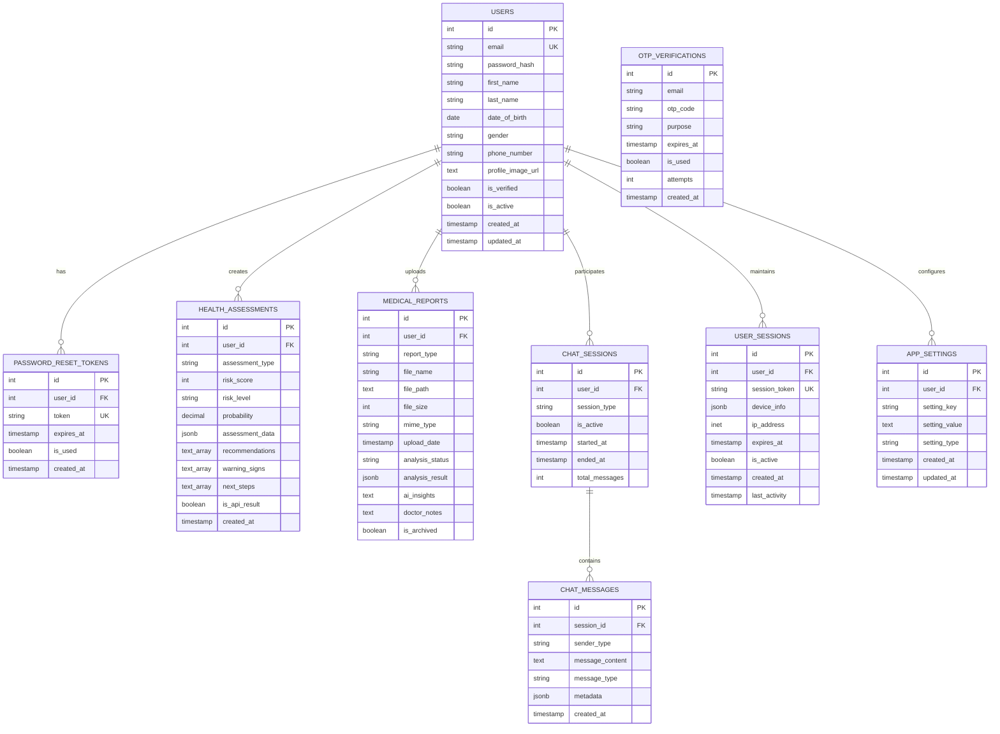

# Echo Health - Database Relationships

## 🗄️ Entity Relationship Diagram



## 🔗 Key Relationships

### 1. User-Centric Design
- **Users** table is the central entity
- All user-related data references the users table
- Cascade delete ensures data consistency

### 2. Authentication Flow
- **OTP_VERIFICATIONS** - Temporary, no foreign key to users (for unregistered users)
- **PASSWORD_RESET_TOKENS** - Links to users table
- **USER_SESSIONS** - Active user sessions

### 3. Health Data
- **HEALTH_ASSESSMENTS** - Stores all assessment results
- **MEDICAL_REPORTS** - File uploads and analysis results
- Both link to users for personalization

### 4. Communication
- **CHAT_SESSIONS** - Groups related messages
- **CHAT_MESSAGES** - Individual messages within sessions
- Hierarchical relationship for better organization

## 📊 Data Flow Patterns

### 1. User Registration Flow
```
OTP_VERIFICATIONS → USERS → USER_SESSIONS
```

### 2. Health Assessment Flow
```
USERS → HEALTH_ASSESSMENTS → (AI Analysis) → Updated Assessment
```

### 3. Report Upload Flow
```
USERS → MEDICAL_REPORTS → (AI Processing) → Analysis Results
```

### 4. Chat Flow
```
USERS → CHAT_SESSIONS → CHAT_MESSAGES
```

## 🎯 Database Design Principles

### 1. Normalization
- 3NF compliance for data integrity
- Minimal redundancy
- Clear separation of concerns

### 2. Scalability
- Indexed foreign keys
- Partitioning strategy for large tables
- JSONB for flexible data storage

### 3. Security
- No sensitive data in logs
- Encrypted password storage
- Token-based authentication

### 4. Performance
- Strategic indexing
- Query optimization
- Connection pooling
