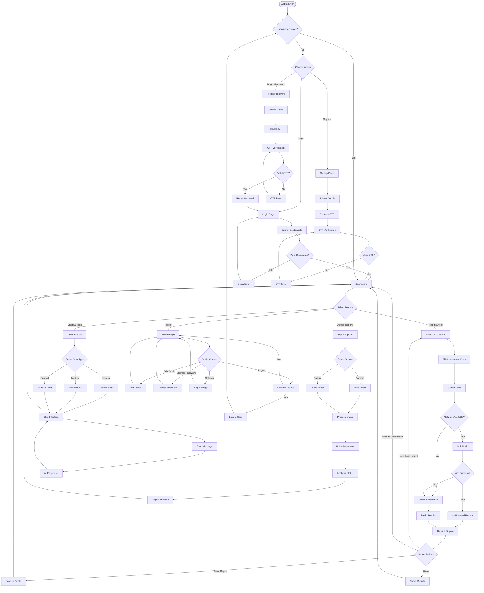
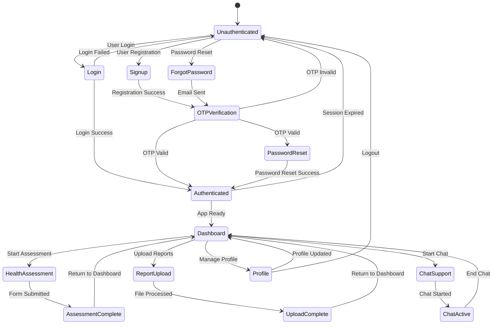
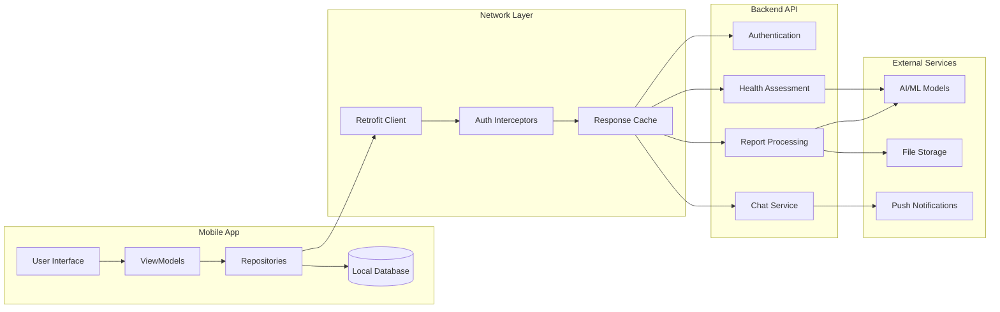
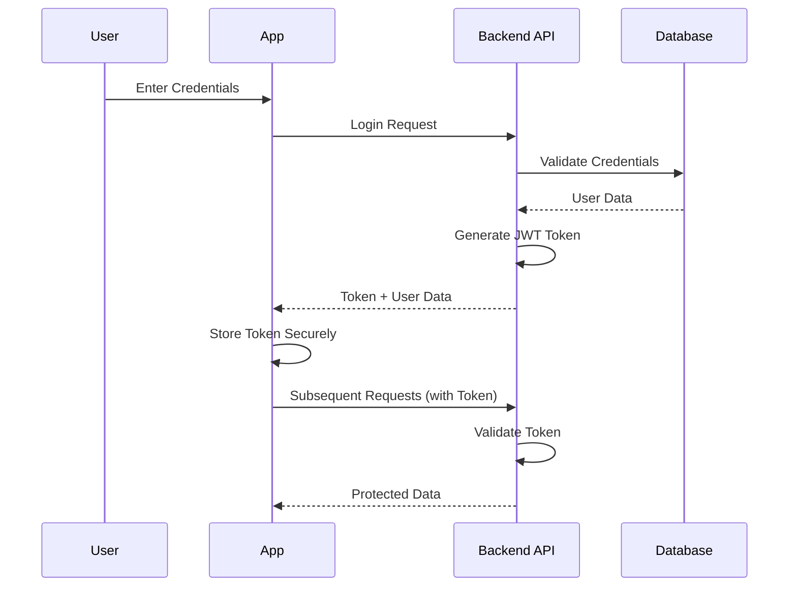

# Echo Health - Detailed App Flow

## 📱 Complete User Journey



## 🔄 State Management Flow



## 📊 Data Flow Architecture



## 🎯 Key Features Flow

### 1. Health Assessment Flow
```
User Input → Form Validation → API Call → AI Processing → Results Display → Save Assessment
```

### 2. Report Upload Flow
```
File Selection → Image Processing → Upload → AI Analysis → Results → Save Report
```

### 3. Chat Support Flow
```
Chat Initiation → Message Sending → AI Processing → Response → Continue Chat
```

### 4. Authentication Flow
```
Credentials → Validation → Token Generation → Session Management → App Access
```

## 🔐 Security Flow



## 📈 Performance Optimization Flow

### 1. Caching Strategy
```
API Request → Check Cache → Cache Hit? → Return Cached Data
                    ↓
                Cache Miss → API Call → Store in Cache → Return Data
```

### 2. Offline Support
```
User Action → Check Network → Online? → API Call
                    ↓
                Offline → Local Processing → Cache for Sync → Return Local Result
```

### 3. Background Sync
```
App Background → Check Pending Actions → Network Available? → Sync Data
```

This comprehensive flow design ensures a smooth, secure, and efficient user experience while maintaining data integrity and system performance.
