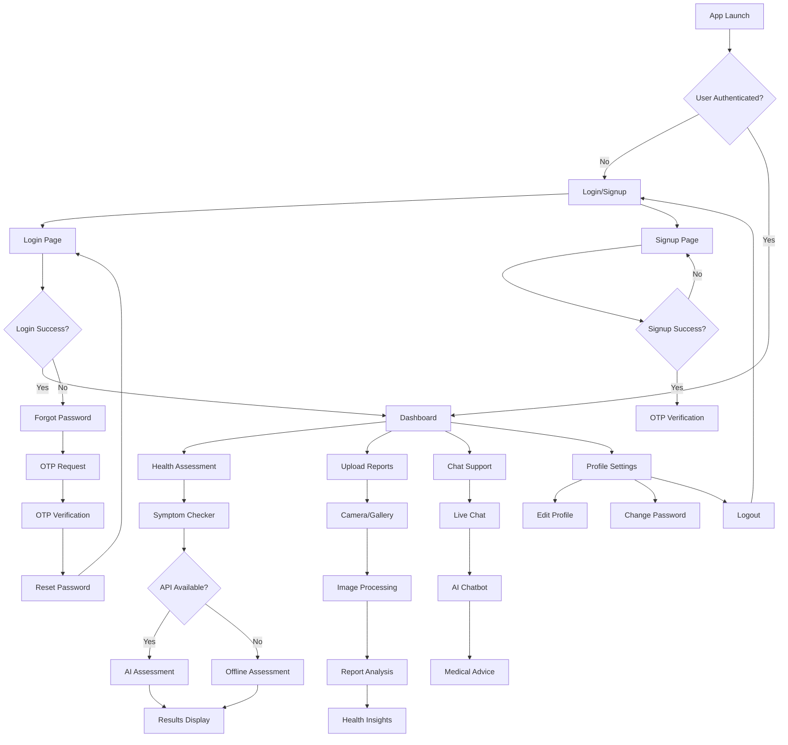

# Echo Health - App Flow & Database Schema

## 📱 App Flow Diagram



## 🗄️ Database Schema

### Users Table
```sql
CREATE TABLE users (
    id SERIAL PRIMARY KEY,
    email VARCHAR(255) UNIQUE NOT NULL,
    password_hash VARCHAR(255) NOT NULL,
    first_name VARCHAR(100) NOT NULL,
    last_name VARCHAR(100) NOT NULL,
    date_of_birth DATE,
    gender VARCHAR(20),
    phone_number VARCHAR(20),
    profile_image_url TEXT,
    is_verified BOOLEAN DEFAULT FALSE,
    is_active BOOLEAN DEFAULT TRUE,
    created_at TIMESTAMP DEFAULT CURRENT_TIMESTAMP,
    updated_at TIMESTAMP DEFAULT CURRENT_TIMESTAMP
);
```

### OTP Verification Table
```sql
CREATE TABLE otp_verifications (
    id SERIAL PRIMARY KEY,
    email VARCHAR(255) NOT NULL,
    otp_code VARCHAR(6) NOT NULL,
    purpose VARCHAR(50) NOT NULL, -- 'registration', 'password_reset'
    expires_at TIMESTAMP NOT NULL,
    is_used BOOLEAN DEFAULT FALSE,
    attempts INTEGER DEFAULT 0,
    created_at TIMESTAMP DEFAULT CURRENT_TIMESTAMP
);
```

### Password Reset Tokens Table
```sql
CREATE TABLE password_reset_tokens (
    id SERIAL PRIMARY KEY,
    user_id INTEGER REFERENCES users(id) ON DELETE CASCADE,
    token VARCHAR(255) UNIQUE NOT NULL,
    expires_at TIMESTAMP NOT NULL,
    is_used BOOLEAN DEFAULT FALSE,
    created_at TIMESTAMP DEFAULT CURRENT_TIMESTAMP
);
```

### Health Assessments Table
```sql
CREATE TABLE health_assessments (
    id SERIAL PRIMARY KEY,
    user_id INTEGER REFERENCES users(id) ON DELETE CASCADE,
    assessment_type VARCHAR(50) NOT NULL, -- 'oral_cancer', 'general'
    risk_score INTEGER NOT NULL,
    risk_level VARCHAR(20) NOT NULL, -- 'Low', 'Moderate', 'High'
    probability DECIMAL(5,4), -- AI probability if available
    assessment_data JSONB NOT NULL, -- Raw form data
    recommendations TEXT[],
    warning_signs TEXT[],
    next_steps TEXT[],
    is_api_result BOOLEAN DEFAULT FALSE,
    created_at TIMESTAMP DEFAULT CURRENT_TIMESTAMP
);
```

### Medical Reports Table
```sql
CREATE TABLE medical_reports (
    id SERIAL PRIMARY KEY,
    user_id INTEGER REFERENCES users(id) ON DELETE CASCADE,
    report_type VARCHAR(50) NOT NULL, -- 'blood_test', 'xray', 'mri', etc.
    file_name VARCHAR(255) NOT NULL,
    file_path TEXT NOT NULL,
    file_size INTEGER,
    mime_type VARCHAR(100),
    upload_date TIMESTAMP DEFAULT CURRENT_TIMESTAMP,
    analysis_status VARCHAR(20) DEFAULT 'pending', -- 'pending', 'processing', 'completed', 'failed'
    analysis_result JSONB,
    ai_insights TEXT,
    doctor_notes TEXT,
    is_archived BOOLEAN DEFAULT FALSE
);
```

### Chat Sessions Table
```sql
CREATE TABLE chat_sessions (
    id SERIAL PRIMARY KEY,
    user_id INTEGER REFERENCES users(id) ON DELETE CASCADE,
    session_type VARCHAR(20) DEFAULT 'general', -- 'general', 'medical', 'support'
    is_active BOOLEAN DEFAULT TRUE,
    started_at TIMESTAMP DEFAULT CURRENT_TIMESTAMP,
    ended_at TIMESTAMP,
    total_messages INTEGER DEFAULT 0
);
```

### Chat Messages Table
```sql
CREATE TABLE chat_messages (
    id SERIAL PRIMARY KEY,
    session_id INTEGER REFERENCES chat_sessions(id) ON DELETE CASCADE,
    sender_type VARCHAR(10) NOT NULL, -- 'user', 'ai', 'doctor'
    message_content TEXT NOT NULL,
    message_type VARCHAR(20) DEFAULT 'text', -- 'text', 'image', 'file'
    metadata JSONB, -- Additional message data
    created_at TIMESTAMP DEFAULT CURRENT_TIMESTAMP
);
```

### User Sessions Table
```sql
CREATE TABLE user_sessions (
    id SERIAL PRIMARY KEY,
    user_id INTEGER REFERENCES users(id) ON DELETE CASCADE,
    session_token VARCHAR(255) UNIQUE NOT NULL,
    device_info JSONB,
    ip_address INET,
    expires_at TIMESTAMP NOT NULL,
    is_active BOOLEAN DEFAULT TRUE,
    created_at TIMESTAMP DEFAULT CURRENT_TIMESTAMP,
    last_activity TIMESTAMP DEFAULT CURRENT_TIMESTAMP
);
```

### App Settings Table
```sql
CREATE TABLE app_settings (
    id SERIAL PRIMARY KEY,
    user_id INTEGER REFERENCES users(id) ON DELETE CASCADE,
    setting_key VARCHAR(100) NOT NULL,
    setting_value TEXT,
    setting_type VARCHAR(20) DEFAULT 'string', -- 'string', 'boolean', 'number', 'json'
    created_at TIMESTAMP DEFAULT CURRENT_TIMESTAMP,
    updated_at TIMESTAMP DEFAULT CURRENT_TIMESTAMP,
    UNIQUE(user_id, setting_key)
);
```

## 🔄 API Endpoints Structure

### Authentication Endpoints
- `POST /api/register/` - User registration
- `POST /api/login/` - User login
- `POST /api/request-otp/` - Request OTP for verification
- `POST /api/verify-otp/` - Verify OTP
- `POST /api/reset-password/` - Reset password with token

### Health Assessment Endpoints
- `POST /api/predict/` - AI-powered symptom analysis
- `GET /api/assessments/` - Get user's assessment history
- `GET /api/assessments/{id}/` - Get specific assessment details

### Medical Reports Endpoints
- `POST /api/reports/upload/` - Upload medical reports
- `GET /api/reports/` - Get user's reports
- `GET /api/reports/{id}/` - Get specific report
- `DELETE /api/reports/{id}/` - Delete report

### Chat Endpoints
- `POST /api/chat/sessions/` - Create new chat session
- `POST /api/chat/messages/` - Send message
- `GET /api/chat/sessions/{id}/messages/` - Get chat history

## 🏗️ Architecture Patterns

### 1. Clean Architecture
```
Presentation Layer (Android UI)
    ↓
Domain Layer (Business Logic)
    ↓
Data Layer (Repository Pattern)
    ↓
Network Layer (Retrofit + API)
```

### 2. Repository Pattern
- `UserRepository` - User data management
- `AssessmentRepository` - Health assessment data
- `ReportRepository` - Medical report management
- `ChatRepository` - Chat functionality

### 3. MVVM Architecture
- **Model**: Data classes and business logic
- **View**: Android Activities/Fragments
- **ViewModel**: UI state management and business logic

## 🔐 Security Considerations

### 1. Data Encryption
- Passwords hashed with bcrypt
- Sensitive data encrypted at rest
- API communications over HTTPS

### 2. Authentication & Authorization
- JWT tokens for session management
- OTP-based verification
- Role-based access control

### 3. Data Privacy
- GDPR compliance
- Data anonymization for analytics
- User consent management

## 📊 Performance Optimizations

### 1. Database Indexing
```sql
-- Performance indexes
CREATE INDEX idx_users_email ON users(email);
CREATE INDEX idx_otp_email_purpose ON otp_verifications(email, purpose);
CREATE INDEX idx_assessments_user_date ON health_assessments(user_id, created_at);
CREATE INDEX idx_reports_user_type ON medical_reports(user_id, report_type);
CREATE INDEX idx_chat_sessions_user ON chat_sessions(user_id, is_active);
```

### 2. Caching Strategy
- Redis for session management
- CDN for static assets
- Local caching for frequently accessed data

### 3. API Rate Limiting
- Per-user rate limits
- Endpoint-specific limits
- DDoS protection

## 🚀 Deployment Architecture

### 1. Backend Services
- Django REST API
- PostgreSQL database
- Redis for caching
- Celery for background tasks

### 2. Mobile App
- Android (Kotlin)
- Retrofit for API calls
- Room for local database
- Firebase for push notifications

### 3. Infrastructure
- Docker containers
- Kubernetes orchestration
- AWS/GCP cloud hosting
- CI/CD pipeline with GitHub Actions

## 📈 Monitoring & Analytics

### 1. Application Monitoring
- Error tracking with Sentry
- Performance monitoring
- User behavior analytics

### 2. Health Metrics
- API response times
- Database query performance
- User engagement metrics

### 3. Business Intelligence
- User growth tracking
- Feature usage analytics
- Health assessment trends
